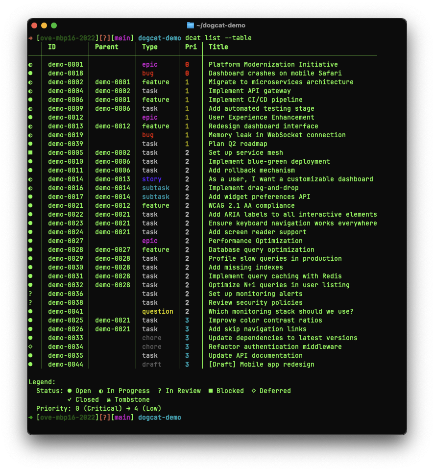
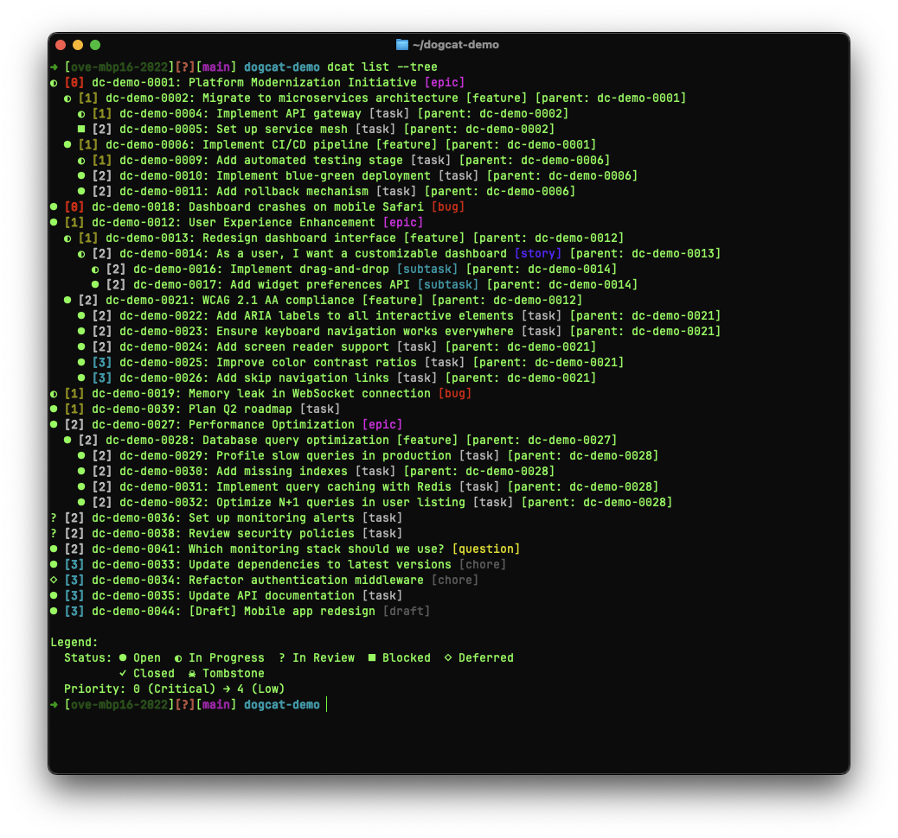
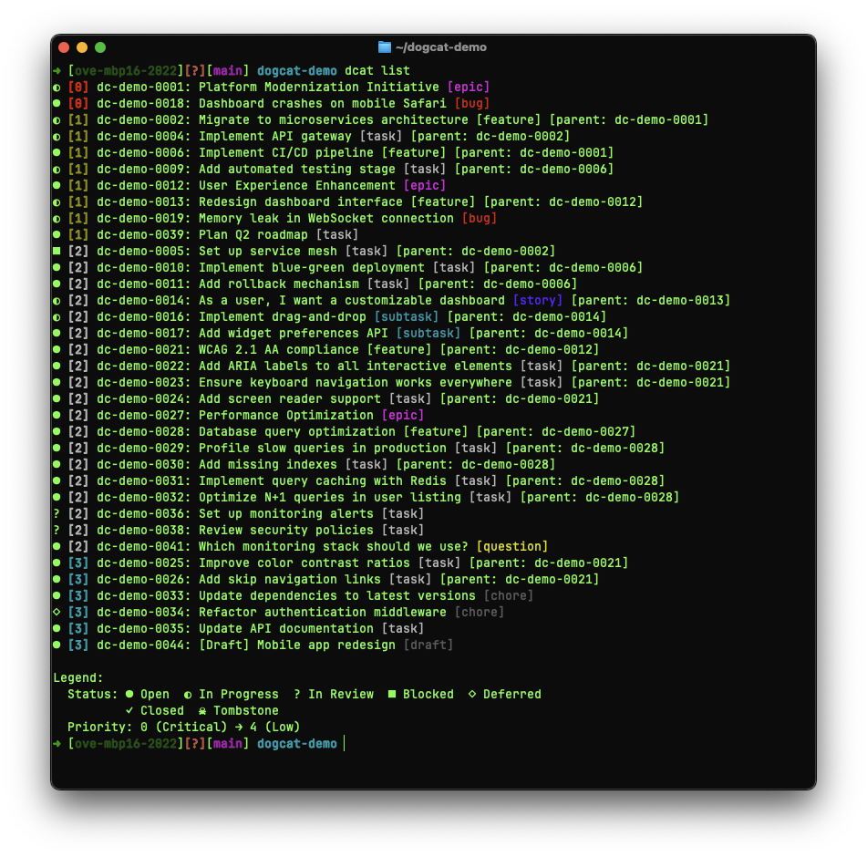
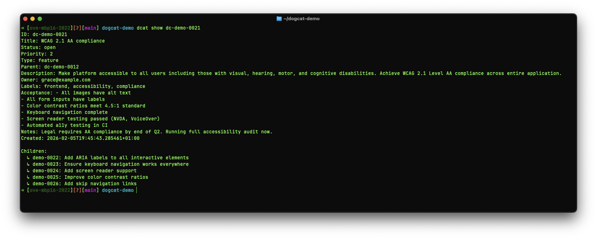
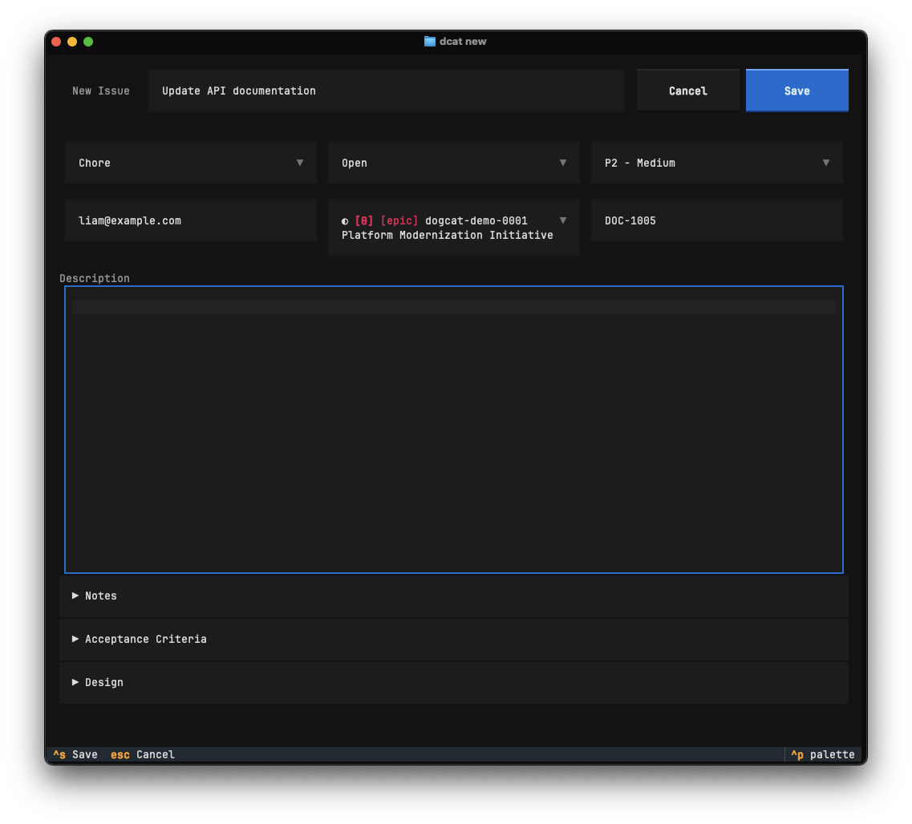
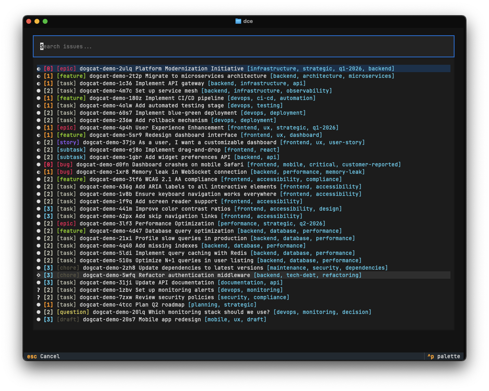
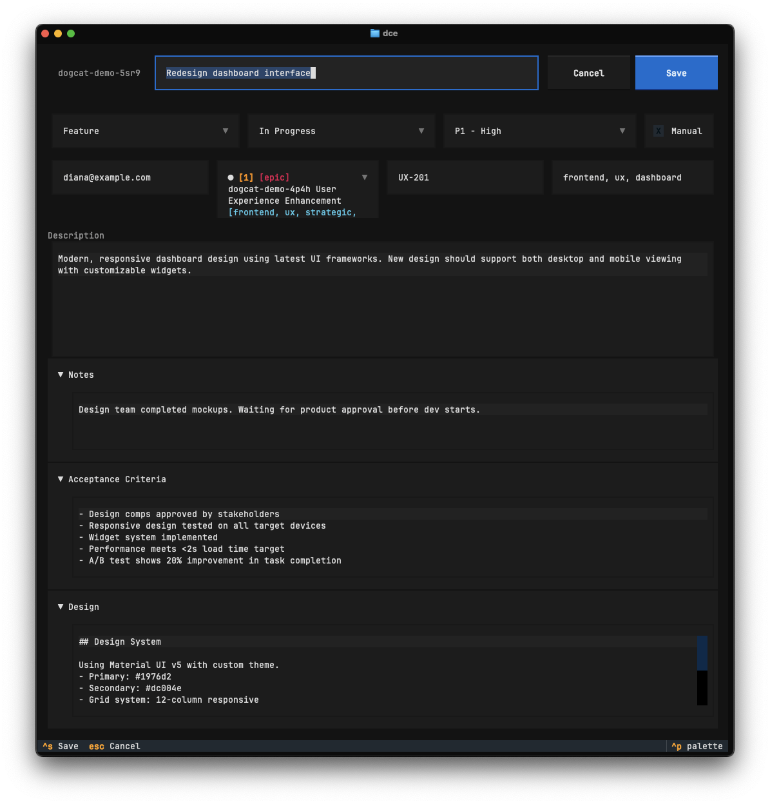
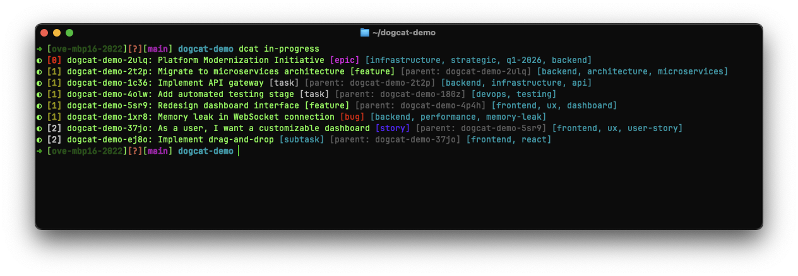
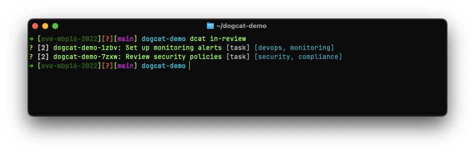

# Dogcat - lightweight, file-based issue tracking and memory upgrade for AI agents (and humans!)

`dogcat` is a memory upgrade for AI agents. No more tracking issues and progress in Markdown files and burning your context window on them. With a simple command line utility (and some TUI niceties!) you can create, edit, manage and display issues.

- [Installation](#installation)
- [Usage](#usage)
  - [Telling your agent to use dogcat](#telling-your-agent-to-use-dogcat)
  - [Command cheat sheet](#command-cheat-sheet)
- [Screenshots](#screenshots)
- [Tips & tricks](#tips--tricks)
- [FAQ](#faq)

## Relation to Beads

Heavily inspired by [steveyegge/beads](https://github.com/steveyegge/beads).

Beads is great, but it is ever expanding and slowly getting more and more complicated as he is building Kubernetes for Agents.

Dogcat is a simpler, more minimal version that focuses on the core functionality. The goal is to keep it simple and not chase orchestration of tens of agents running at the same time.

It also avoids some complexity by not using a daemon and/or SQL database, and only relying on the `issues.jsonl` file.

## Installation

### Homebrew (macOS)

```bash
brew install oroddlokken/tap/dogcat
```

This installs `dcat`/`dogcat` and handles Python and dependencies automatically via `uv`.

### pip / pipx / uv (all platforms)

```bash
# With uv (recommended for CLI tools)
uv tool install dogcat

# With pipx
pipx install dogcat

# With pip
pip install dogcat
```

### From source

Install `uv`, then run `./dcat.py`.

## Usage

Run `dcat init` to initialize the program. Then you can run `dcat prime` to see the information an AI agent should use.  
For a guide more suited for humans, run `dcat guide`.

Alternatively, you can run `dcat init --use-existing-folder /home/me/project/.dogcats` to use a shared dogcat database.

If you don't want to store issues in git, use `dcat init --no-git`.

### Telling your agent to use dogcat

In your `AGENTS.md`/`CLAUDE.md` file, add something like the following:

``````text
# Agent Instructions

## Issue tracking

This project uses **dcat** for issue tracking. You MUST run `dcat prime --opinionated` for instructions.
Then run `dcat list --agent-only` to see the list of issues. Generally we work on bugs first, and always on high priority issues first.

When running multiple `dcat` commands, make separate parallel Bash tool calls instead of chaining them with `&&` and `echo` separators.

Mark each issue `in_progress` right when you start working on it — not before. Set `in_review` when work on that issue is done before moving on. The status should reflect what you are *actually* working on right now.

It is okay to work on multiple related issues at the same time, but do NOT batch-mark an entire backlog as `in_progress` upfront. If there is a priority conflict, ask the user which to focus on first.

If the user brings up a new bug, feature or anything else that warrants changes to the code, ALWAYS ask if we should create an issue for it before you start working on the code. When creating issues, set appropriate labels using `--labels` based on the issue content (e.g. `cli`, `tui`, `api`, `docs`, `testing`, `refactor`, `ux`, `performance`, etc.).

When research or discussion produces findings relevant to an existing issue, ask these as **separate questions in order**:

1. First ask: "Should I update issue [id] with these findings?"
2. Only after that, separately ask: "Should I start working on the implementation?"
Do NOT combine these into one question. The user may want to update the issue without starting work.

### Closing Issues - IMPORTANT

NEVER close issues without explicit user approval. When work is complete:

1. Set status to `in_review`: `dcat update --status in_review $issueId`
2. Ask the user to test
3. Ask if we can close it: "Can I close issue [id] '[title]'?"
4. Only run `dcat close` after user confirms
5. Ask: "Should I add this to CHANGELOG.md?" — update if yes
``````

This is only a starting point - it's up to you to decide how dogcat fits best in your workflow!  
You can always run `dcat example-md` to get an example of what to put in your AGENTS.md/CLAUDE.md file.

`dcat prime` mainly concerns itself on how to use the dcat CLI, not how your workflow should be.  
`dcat prime --opinionated` is a more opinionated version of the guide for agents, with stricter guidelines.  

 You can run `diff <(dcat prime) <(dcat prime --opinionated)` to see the differences.

### Command cheat sheet

| Command | Action |
| --- | --- |
| **Creating** | |
| `dcat create "My first bug" -t bug -p 0` | Create a bug issue, with priority 0 |
| `dcat c b 0 "My first bug"` | Same as above, using `dcat c` shorthands for type and priority |
| `dcat create "Turn off the lights" --manual` | Create a manual issue (not for agents) |
| **Viewing** | |
| `dcat list` | List all open issues |
| `dcat list --tree` | List issues as a parent-child tree |
| `dcat show $id` | Show full details about an issue |
| `dcat search "login"` | Search issues across all fields |
| `dcat search "bug" --type bug` | Search with type filter |
| `dcat labels` | List all labels with counts |
| **Filtering** | |
| `dcat ready` | List issues not blocked by other issues |
| `dcat blocked` | List all blocked issues |
| `dcat in-progress` | List issues currently in progress |
| `dcat in-review` | List issues currently in review |
| `dcat pr` | List issues in progress and in review |
| `dcat manual` | List issues marked as manual |
| `dcat recently-added` | List recently added issues |
| `dcat recently-closed` | List recently closed issues |
| **Updating** | |
| `dcat update $id --status in_progress` | Update an issue's status |
| `dcat close $id --reason "Fixed the bug"` | Close an issue with reason |
| `dcat reopen $id` | Reopen a closed issue |
| `dcat delete $id` | Delete an issue (soft delete) |
| **TUI** | |
| `dcat tui` | Launch the interactive TUI dashboard |
| `dcat new` | Interactive TUI for creating a new issue |
| `dcat edit [$id]` | Interactive TUI for editing an issue |
| **Git & maintenance** | |
| `dcat git setup` | Install the JSONL merge driver for git |
| `dcat history` | Show change history timeline |
| `dcat diff` | Show uncommitted issue changes |
| `dcat doctor` | Run health checks on issue data |
| `dcat archive` | Archive closed issues to reduce startup load |
| `dcat prune` | Permanently remove deleted issues |
| `dcat config` | Manage dogcat configuration |
| `dcat stream` | Stream issue changes in real-time (JSONL) |

## Screenshots

Compact table view showing tasks with ID, Parent, Type, Priority, and Title columns:  


Hierarchical tree view displaying parent-child issue relationships:  


Detailed list view with status indicators and full issue information:  


Ready view showing unblocked issues available for work:  


Detailed issue view with description, acceptance criteria, and metadata:  


TUI for creating new issues (`dcat new`):  


TUI for editing issues, select the one you want to edit (`dcat edit`):  


TUI for editing issues (`dcat edit $id`):  


List issues in progress:  


List issues in review:  


## Tips & tricks

Personally, I use these aliases:

```bash
alias dcl="dcat list --tree"
alias dct="dcat list --table"

alias dcn="dcat new"
alias dce="dcat edit"
```

## FAQ

**What's a dogcat?**  
¯\_(ツ)_/¯ Some cats are dog-like, and some dogs are cat-like.

**Why a new project and just not use or fork beads?**  
Dogcat started out as some tooling on top of beads, that quickly grew into its own separate project. I found it tricky to integrate against beads, and instead of trying to keep up with changes in beads, it was more fun to just build my own.

**Why Python?**  
I wanted to use [Textual](https://textual.textualize.io/), which is awesome for making TUIs with. It's also the language I am the most familiar with.

## Migrating from beads

If you already have a collection of issues in Beads, you can import them in dogcat. In a folder without a `.dogcats` folder run `dogcat import-beads /path/to/project/.beads/issues.jsonl`.

## Development

`dogcat` is now in a state where it can be dogfooded. Included is the issues.jsonl file containing the current issues.
