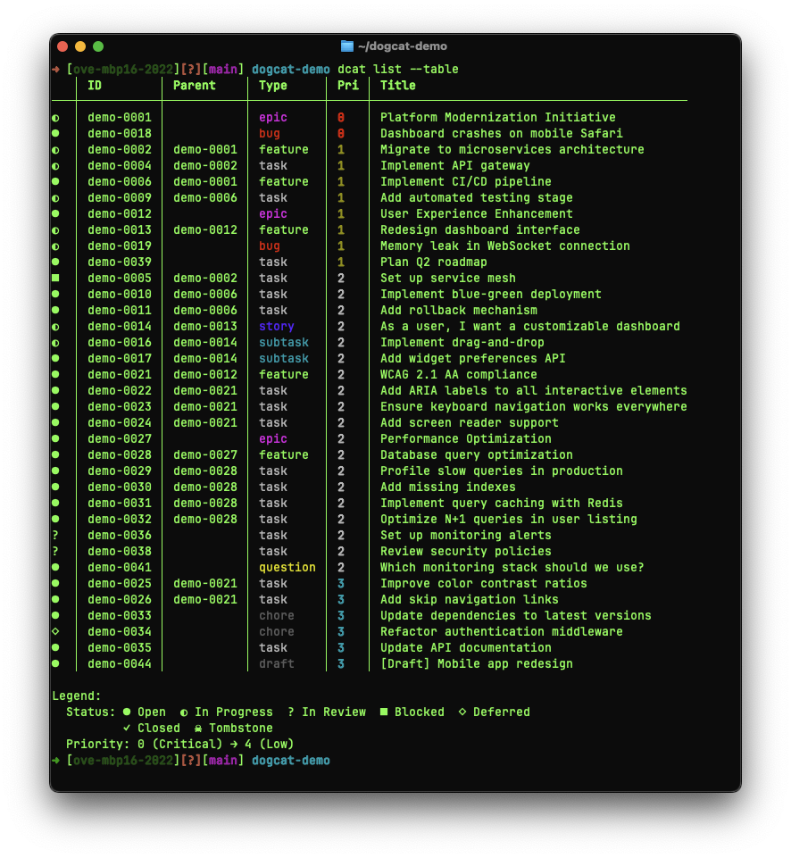
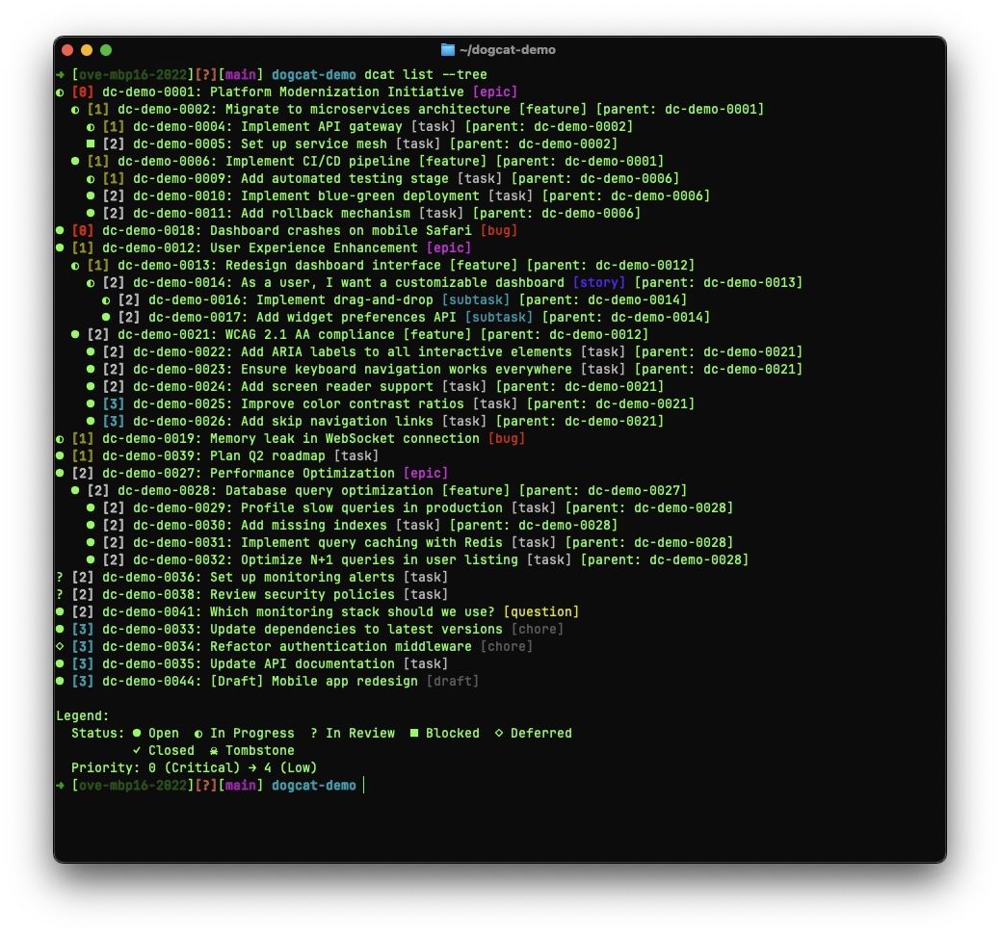
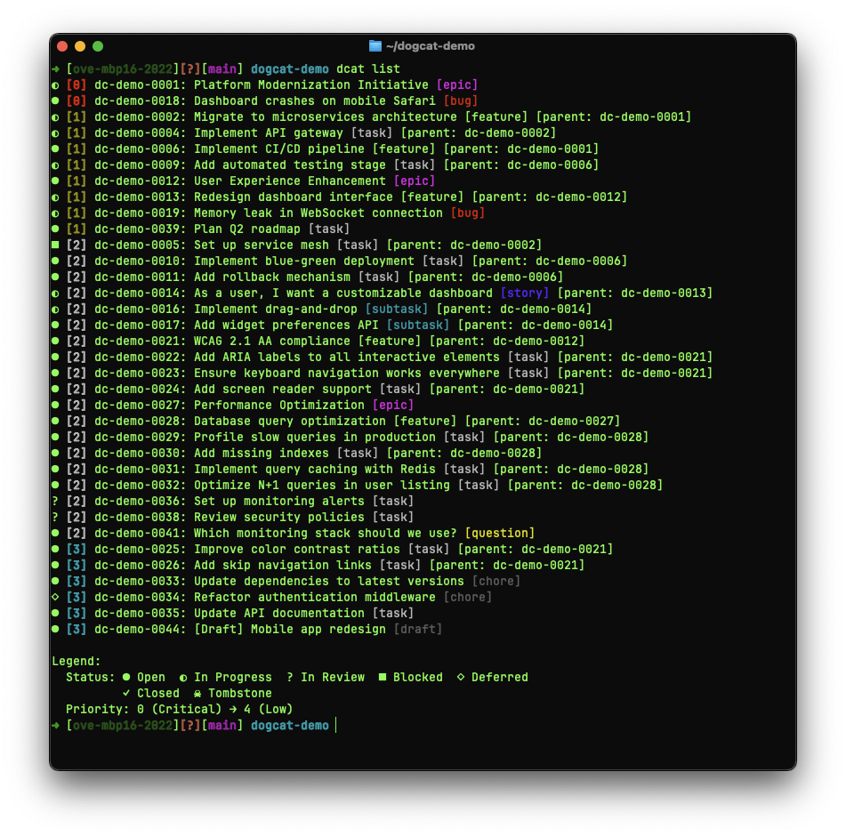
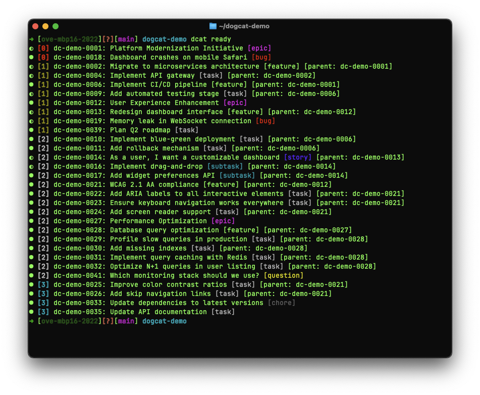
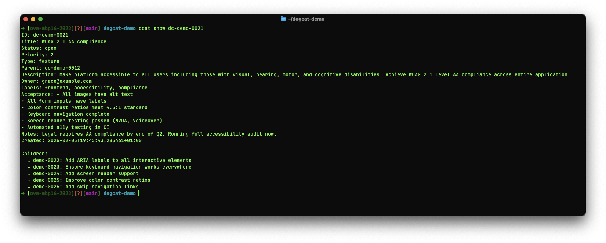
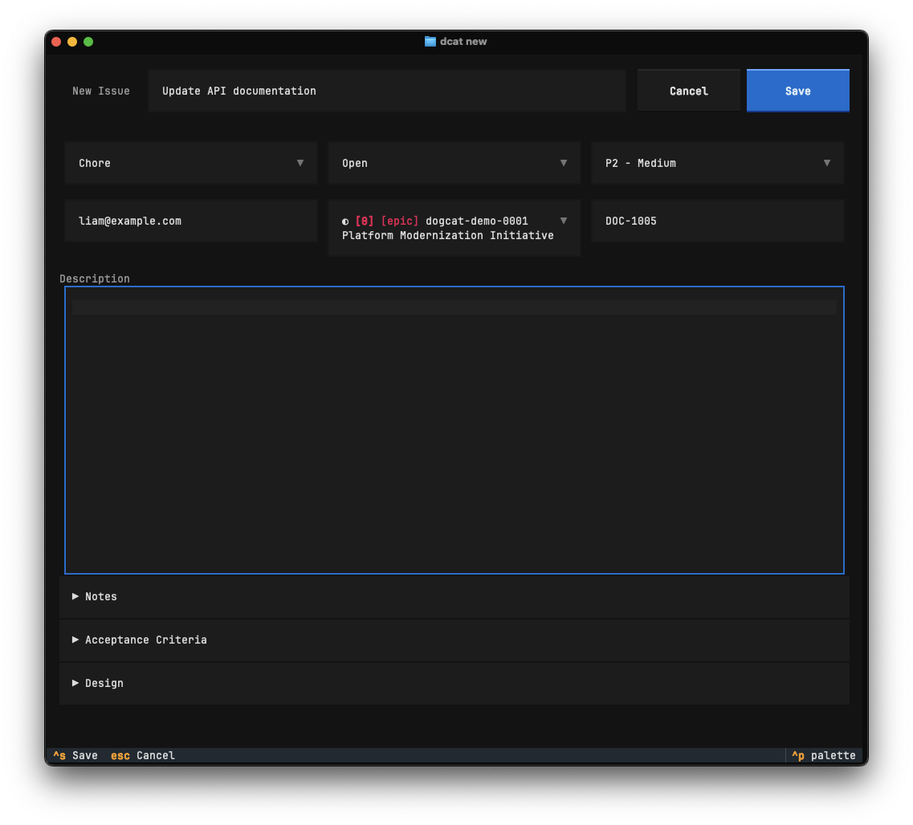
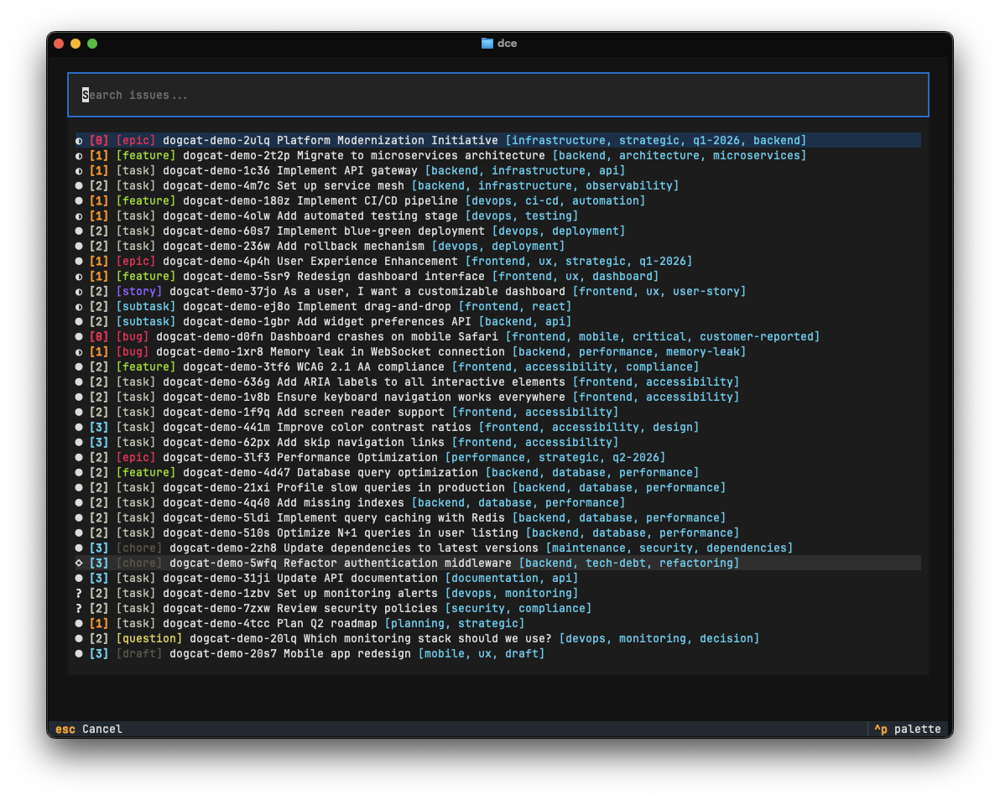
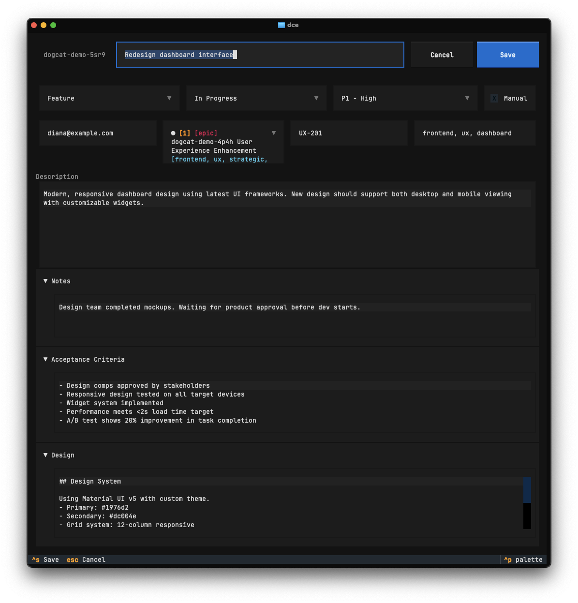
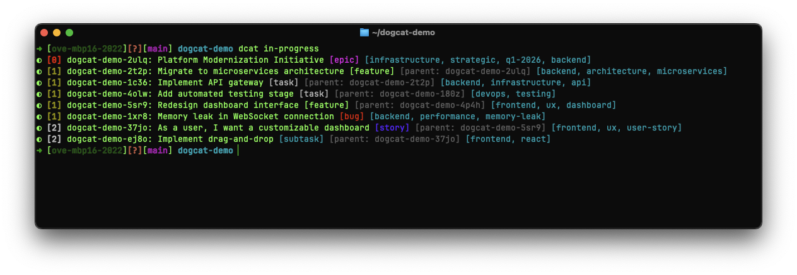
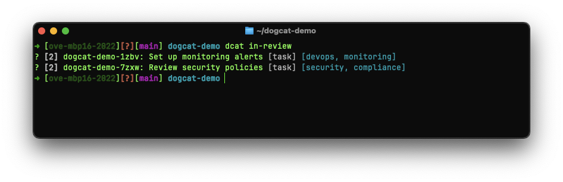

# Dogcat - lightweight, file-based issue tracking and memory upgrade for AI agents (and humans!)

`dogcat` is a memory upgrade for AI agents. No more tracking issues and progress in Markdown files and burning your context window on them. With a simple command line utility (and some TUI niceties!) you can create, edit, manage and display issues.

- [Installation](#installation)
- [Usage](#usage)
  - [Telling your agent to use dogcat](#telling-your-agent-to-use-dogcat)
  - [Command cheat sheet](#command-cheat-sheet)
- [Screenshots](#screenshots)
- [Tips & tricks](#tips--tricks)
- [FAQ](#faq)

## Installation

### Homebrew (macOS)

```bash
brew install oroddlokken/tap/dogcat
```

This installs `dcat`/`dogcat` and handles Python and dependencies automatically via `uv`.

### pip / pipx / uv (all platforms)

```bash
# With uv (recommended for CLI tools)
uv tool install dogcat

# With pipx
pipx install dogcat

# With pip
pip install dogcat
```

### From source

Install `uv`, then run `./dcat.py`.

## Usage

Run `dcat init` to initialize the program. Then you can run `dcat prime` to see the information an AI agent should use.  
For a guide more suited for humans, run `dcat guide`.

If you don't want to store issues in git, use `dcat init --no-git`.

### Sharing a dogcat database between multiple repos

Three setups, in order of scope:

1. **Per-repo:** `dcat init` creates a local `.dogcats/`. The default.

2. **A few repos sharing one store:** `dcat init --use-existing-folder /path/to/.dogcats` writes a `.dogcatrc` in the repo pointing at the shared directory. Each repo can set its own namespace with `dcat config set --local namespace <name>`.

3. **Machine-wide default:** Set a global default store that any new repo without its own `.dogcats/` or `.dogcatrc` will fall back to:

   ```bash
   dcat config set --global default_storage ~/dev/issues/.dogcats
   ```

See [docs/sharing-a-database.md](docs/sharing-a-database.md) for the namespace rules, the resolution order, and the config precedence chain.

### Telling your agent to use dogcat

Run `dcat example-md` to print a starting block for your `AGENTS.md`/`CLAUDE.md`. It covers the session-start command, when to mark an issue `in_progress`, when to ask before creating an issue, and the approval gate before closing one:

```bash
dcat example-md >> AGENTS.md
```

This is only a starting point - it's up to you to decide how dogcat fits best in your workflow!

`dcat prime` mainly concerns itself on how to use the dcat CLI, not how your workflow should be.  
`dcat prime --opinionated` is a more opinionated version of the guide for agents, with stricter guidelines.  

You can run `diff <(dcat prime) <(dcat prime --opinionated)` to see the differences.

### Command cheat sheet

| Command | Action |
| --- | --- |
| **Global** | |
| `dcat -C /path/to/repo list` | Run as if dcat started in another directory (must come before the subcommand) |
| **Creating** | |
| `dcat create "My first bug" -t bug -p 0` | Create a bug issue, with priority 0 |
| `dcat c b 0 "My first bug"` | Same as above, using `dcat c` shorthands for type and priority |
| `dcat create "Turn off the lights" --manual` | Create a manual issue (not for agents) |
| **Viewing** | |
| `dcat list` | List all open issues |
| `dcat list --tree` | List issues as a parent-child tree |
| `dcat show $id` | Show full details about an issue |
| `dcat show $id1 $id2` | Show several issues, separated by a rule (NDJSON with `--json`) |
| `dcat show $id --include-history` | Show an issue with its full event history appended |
| `dcat search "login"` | Search issues across all fields |
| `dcat search "bug" --type bug` | Search with type filter |
| `dcat labels` | List all labels with counts |
| **Visualizing** | |
| `dcat graph` | Show the full dependency graph as ASCII |
| `dcat graph $id` | Show the subgraph reachable from an issue |
| **Filtering** | |
| `dcat ready` | List issues not blocked by other issues |
| `dcat blocked` | List all blocked issues |
| `dcat in-progress` | List issues currently in progress |
| `dcat in-review` | List issues currently in review |
| `dcat pr` | List issues in progress and in review |
| `dcat manual` | List issues marked as manual |
| `dcat recently-added` | List recently added issues |
| `dcat recently-closed` | List recently closed issues |
| **Updating** | |
| `dcat update $id --status in_progress` | Update an issue's status |
| `dcat close $id --reason "Fixed the bug"` | Close an issue with reason |
| `dcat reopen $id` | Reopen a closed issue |
| `dcat delete $id` | Delete an issue (soft delete) |
| **TUI** | |
| `dcat tui` | Launch the interactive TUI dashboard |
| `dcat new` | Interactive TUI for creating a new issue |
| `dcat edit [$id]` | Interactive TUI for editing an issue |
| **Proposals & web** | |
| `dcat web propose` | Start the proposal web form (blocks until you stop it) |
| `dcat propose --to /path/to/repo "Title"` | Send a proposal to another repo's inbox |
| `dcat inbox list` | List inbox proposals |
| `dcat inbox accept $id` | Accept a proposal and create a local issue from it |
| `dcat inbox reject $id` | Reject a proposal |
| **Git & maintenance** | |
| `dcat git setup` | Install the JSONL merge driver for git |
| `dcat git check` | Check that the merge driver is installed in this clone |
| `dcat repair-jsonl` | Move malformed lines out of the JSONL stores |
| `dcat history` | Show change history timeline |
| `dcat diff` | Show uncommitted issue changes |
| `dcat doctor` | Run health checks on issue data |
| `dcat archive` | Archive closed issues to reduce startup load |
| `dcat prune` | Permanently remove deleted issues |
| `dcat config` | Manage dogcat configuration |
| `dcat stream` | Stream issue changes in real-time (JSONL) |

### Git Workflows: Merges and Field-Level Conflicts

Dogcat uses a custom merge driver (`dcat git setup` installs it) to automatically resolve JSONL conflicts. The driver implements a state-based merge algebra:

- **Issues**: LWW by status finality first, then `updated_at`. Status rank is `draft` < the active statuses (`open`, `in_progress`, `in_review`, `blocked`, `deferred`) < `closed` < `tombstone`; a more final status wins regardless of timestamp, so a branch that closes or deletes an issue is never silently reverted by a later edit that left it open elsewhere. Within one rank the later `updated_at` wins **entirely** — concurrent edits to different fields on the same issue may result in data loss. For example, if branch A edits the title and branch B edits the priority (with a later timestamp) and both leave the issue open, B's entire record wins and A's title edit is lost.

- **Proposals**: LWW by status finality (`open < closed < tombstone`), then by `updated_at`. Once a proposal is closed or tombstoned, it cannot be reverted.

- **Dependencies & Links**: Three-way merge with add/remove semantics. Deletes on one side win over silent no-ops on the other.

- **Events**: Append-only, deduplicated by identity.

**Detecting field-level conflicts:** After a merge, run `dcat doctor --post-merge` to detect concurrent edits. The output shows which fields were affected and their values on each branch. If you detect unexpected conflicts, coordinate edits across branches or use `dcat update` to manually restore lost changes.

See [docs/merge-coverage.md](docs/merge-coverage.md) for the claim-to-test matrix and the known limitations.

## Screenshots

Table view (`dcat list --table`):  


Tree view (`dcat list --tree`):  


List view (`dcat list`):  


Ready issues (`dcat ready`):  


Issue details (`dcat show $id`):  


TUI for creating new issues (`dcat new`):  


TUI for editing issues, select the one you want to edit (`dcat edit`):  


TUI for editing issues (`dcat edit $id`):  


List issues in progress:  


List issues in review:  


## Tips & tricks

Personally, I use these aliases:

```bash
alias dcl="dcat list --tree"
alias dct="dcat list --table"

alias dcn="dcat new"
alias dce="dcat edit"
```

## FAQ

**What's a dogcat?**  
¯\_(ツ)_/¯ Some cats are dog-like, and some dogs are cat-like.

**Why Python?**  
I wanted to use [Textual](https://textual.textualize.io/), which is awesome for making TUIs with. It's also the language I am the most familiar with.

## Development

`dogcat` is now in a state where it can be dogfooded. Included is the issues.jsonl file containing the current issues.
